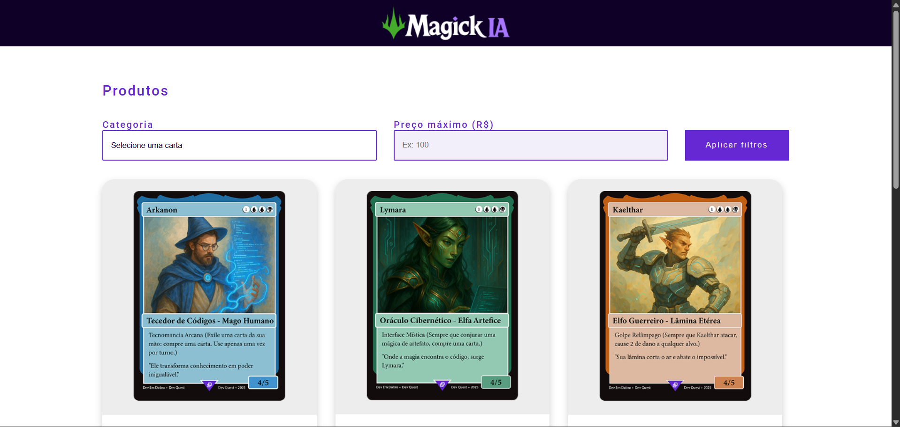

# Magick IA - Loja de Cartas

Bem-vindo ao **Magick IA**, uma interface de loja fictícia onde é possível visualizar e filtrar cartas mágicas por categoria e preço. Os visitantes podem simular a compra das cartas através de links diretos para o WhatsApp.

## 🧩 Funcionalidades

- Exibição de cartas mágicas com nome, imagem, categoria e preço.
- Filtros por categoria (Comum, Rara, Épica) e por preço máximo.
- Botões de compra que redirecionam para o WhatsApp com uma mensagem pré-preenchida.
- Estilização responsiva com CSS puro.

## 🖼️ Captura de Tela

> 

## 📁 Estrutura do Projeto

magick-ia/
├── index.html
├── README.md
├── src/
│ ├── css/
│ │ ├── estilos.css
│ │ ├── responsivo.css
│ │ └── reset.css
│ ├── images/
│ │ ├── logo.png
│ │ ├── seta-para-baixo.png
│ │ ├── preview.png
│ │ ├── carta-arkanon.png
│ │ ├── carta-lymara.png
│ │ ├── carta-kaelthar.png
│ │ ├── carta-maldrik.png
│ │ ├── carta-drahven.png
│ │ └── carta-nyxsombra.png
│ └── js/
│ └── index.js

## 🛠️ Tecnologias Utilizadas

- HTML5
- CSS3 (com responsividade)
- JavaScript (filtragem de cartas)
- Google Fonts (Roboto)

## 🚀 Como Usar

1. Clone o repositório:

```bash
git clone https://github.com/seu-usuario/magick-ia.git
```

2. Abra o arquivo index.html diretamente no navegador ou use uma extensão como Live Server no VS Code.

3. Navegue pelas cartas, aplique filtros e clique nos botões para simular a compra.

## ✅ Melhorias Futuras

- Implementar backend para cadastro e gerenciamento das cartas.

- Sistema de carrinho de compras.

- Integração com sistema de pagamento.

- Tela de administração para novos produtos.

## 📄 Licença

Este projeto é apenas para fins educacionais e não possui fins comerciais. Todos os direitos reservados © 2025.

## 📬 Contato

Em caso de dúvidas ou sugestões, sinta-se à vontade para abrir uma issue ou entrar em contato comigo diretamente.

Email: gabriel21silvaalves@gmail.com

Desenvolvido por Gabriel Silva Alves
